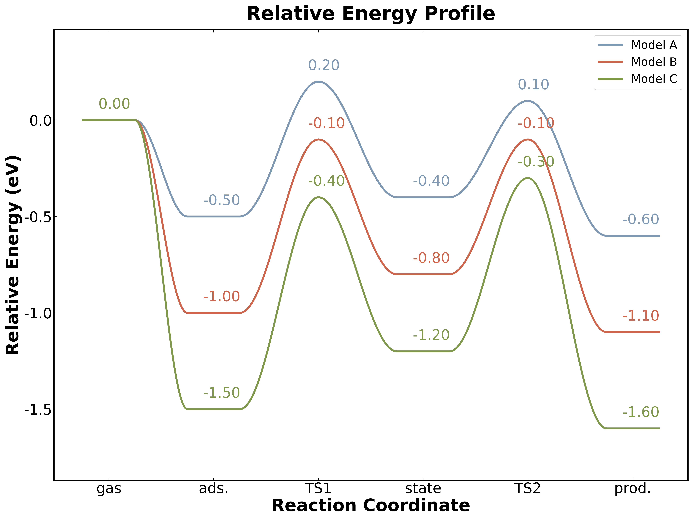
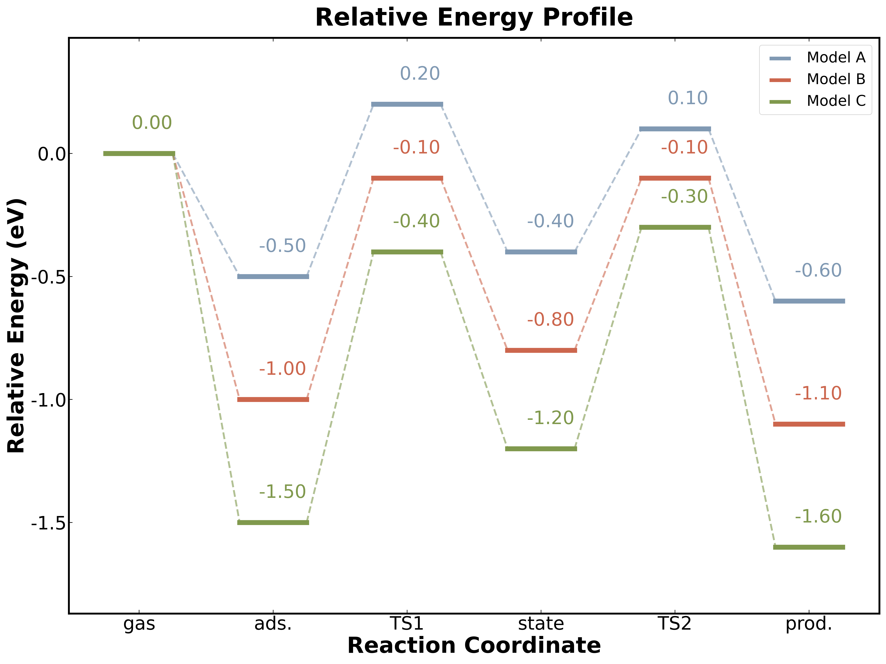

# TSPlot v1.0

## 能量反应路径图绘制工具

[](https://github.com/ZhangLiu-HUST/tsplot)
[](https://www.python.org/)
[](LICENSE)

TSPlot 是一款专业的化学反应路径能量剖面图绘制工具，支持生成两种风格的能垒图：平滑曲线风格（curve）和分段台阶风格（state）。


*curve 风格示例*


*state 风格示例*

---

## 📋 目录

- [功能特性](#功能特性)
- [安装说明](#安装说明)
- [快速开始](#快速开始)
- [使用指南](#使用指南)
  - [GUI 版本](#gui-版本)
  - [CLI 版本](#cli-版本)
- [数据格式](#数据格式)
- [配置说明](#配置说明)
- [项目结构](#项目结构)
- [作者信息](#作者信息)
- [许可证](#许可证)

---

## ✨ 功能特性

### 双风格绘图
- **Curve 风格**: 横线 + 平滑余弦曲线，适合展示连续反应路径
- **State 风格**: 分段实线 + 虚线连接，适合展示离散状态转换

### 丰富的自定义选项
- 图像标题、坐标轴标题自定义
- 字体大小、线宽、颜色配置
- 能量数值标签位置微调（X/Y 偏移、对齐方式）
- 图例位置、边框配置
- Y 轴范围自动计算或手动设置

### 便捷的交互方式
- **GUI 版本（推荐）**: 
  - 图形界面操作，实时预览，一键导出
  - **双击 `tsplot.exe` 即可运行**（Windows，无需 Python）
- **CLI 版本**: 命令行操作，适合批处理（Python 脚本）

### 内置数据模板
提供标准 CSV 数据模板，方便用户快速上手。

---

## 🔧 安装说明

### 系统要求
- Windows 10/11
- Python 3.11+（仅脚本版本需要）

### 方法一：使用可执行文件（推荐 Windows 用户）
1. 下载发布包并解压
2. 进入 `GUI` 文件夹
3. **双击 `tsplot.exe`** 即可打开图形界面
   - 无需安装 Python
   - 支持导入数据、配置参数、预览图片、导出结果

### 方法二：使用 Python 脚本

#### 1. 安装依赖
```bash
pip install matplotlib numpy
```

#### 2. 运行 GUI 版本
```bash
python GUI/tsplot_GUI.py
```

#### 3. 运行 CLI 版本
```bash
python CLI/tsplot_CLI.py data_template/data_template-1.csv
```

---

## 🚀 快速开始

### 第一步：准备数据

参考 `data_template/data_template-1.csv` 创建您的数据文件：

```csv
index,Model A,Model B,Model C
color,"0.5, 0.6, 0.7","0.8, 0.4, 0.3","0.5, 0.6, 0.3"
gas,0,0,0
ads.,-0.5,-1,-1.5
TS1,0.2,-0.1,-0.4
state,-0.4,-0.8,-1.2
TS2,0.1,-0.1,-0.3
prod.,-0.6,-1.1,-1.6
```

### 第二步：运行程序

**GUI 版本（推荐）：**
```bash
# 双击运行 tsplot.exe
# 或命令行运行
python GUI/tsplot_GUI.py
```
- 点击"浏览..."选择数据文件（或直接使用内置模板）
- 调整配置选项
- 点击"🎨 开始绘图"预览
- 点击"💾 输出图片"保存

**CLI 版本：**
```bash
# 使用脚本
python CLI/tsplot_CLI.py your_data.csv
```

### 第三步：查看结果

程序会同时生成两张图片：
- `curve.png` - 平滑曲线风格
- `state.png` - 分段台阶风格

---

## 📖 使用指南

### GUI 版本


#### 界面布局
- **左侧控制面板**: 文件选择、配置选项、操作按钮
- **右侧预览区域**: 实时显示生成的图片

#### 配置选项
1. **文件选择**: 导入 CSV 数据文件，或导出内置模板
2. **标题配置**: 设置图片主标题、X/Y 轴标题
3. **字体配置**: 调整各类文字大小
4. **显示配置**: 
   - 能量数值标签显示开关
   - 标签位置微调（X/Y 偏移、对齐方式）
   - Y 轴范围设置
5. **图例配置**: 图例显示、位置、边框
6. **高级配置**: 图像尺寸、线宽、插值点数等

#### 操作按钮
- **🎨 开始绘图**: 生成图片并在右侧预览
- **🔍 放大查看**: 在新窗口中查看大图
- **💾 输出图片**: 保存高清图片到指定目录

### CLI 版本

#### 基本用法
```bash
tsplot_CLI.py <数据文件.csv>
```

#### 示例
```bash
# 使用内置模板测试
python CLI/tsplot_CLI.py data_template/data_template-1.csv

# 使用自己的数据
python CLI/tsplot_CLI.py reaction_data.csv
```

#### 输出文件
- `curve.png` - Curve 风格能量图
- `state.png` - State 风格能量图

---

## 📊 数据格式

CSV 文件格式说明：

| 行号 | 内容 | 说明 |
|------|------|------|
| 1 | 表头 | 第一列为 `index`，后续为路径/模型名称 |
| 2 | 颜色 | 第一列为 `color`，后续为 RGB 值（如 `0.5, 0.6, 0.7`）|
| 3+ | 数据 | 第一列为状态名称，后续为各路径的能量值（eV）|

### 示例数据

```csv
index,Model A,Model B,Model C
color,"0.5, 0.6, 0.7","0.8, 0.4, 0.3","0.5, 0.6, 0.3"
gas,0,0,0
ads.,-0.5,-1,-1.5
TS1,0.2,-0.1,-0.4
state,-0.4,-0.8,-1.2
TS2,0.1,-0.1,-0.3
prod.,-0.6,-1.1,-1.6
```

### 注意事项
- 能量值单位为 eV（电子伏特）
- 使用相对能量（以某个参考态为 0）
- 过渡态名称建议以 `TS` 开头（如 `TS1`, `TS2`）
- 空值可留空，程序会自动处理

---

## ⚙️ 配置说明

### 默认配置值

```python
# 图像尺寸
figure_size = (20, 15)      # 宽 x 高（英寸）
dpi = 300                    # 分辨率

# 字体大小
font_size_title = 40
font_size_axis_title = 36
font_size_axis_tick = 30
font_size_energy_label = 30
font_size_legend = 24

# 能量数值标签位置（curve 图）
label_offset_x_curve = -0.2   # X 偏移（负值向左）
label_offset_y_curve = 0.06   # Y 偏移（正值向上）
label_ha_curve = 'left'       # 水平对齐

# 能量数值标签位置（state 图）
label_offset_x_state = 0.5    # X 偏移
label_offset_y_state = 0.1    # Y 偏移
label_ha_state = 'right'      # 水平对齐

# 线宽
line_width_curve = 4
line_width_segment = 8
line_width_frame = 3
line_width_connector = 3.0    # state 图虚线宽度

# Y 轴范围
auto_y_range = True           # 自动计算
y_axis_limits = (-2.0, 1.0)   # 手动设置范围（自动计算关闭时使用）
```

### 自定义配置

**CLI 版本代码中修改：**
```python
config = PlotConfig(
    title_text="My Reaction Profile",
    label_offset_x_curve=-0.3,
    label_offset_y_curve=0.1,
    # ... 其他配置
)
```

**GUI 版本：** 直接在界面中调整各项参数。

---

## 📁 项目结构

```
tsplot/
├── README.md                    # 本说明文档
├── CLI/
│   └── tsplot_CLI.py           # CLI 版本 Python 脚本
├── GUI/
│   ├── tsplot.exe              # GUI 可执行文件（Windows，双击即用）
│   └── tsplot_GUI.py           # GUI 版本 Python 脚本
└── data_template/
    └── data_template-1.csv     # 数据模板示例
```

**说明**:
- `tsplot.exe`: 打包好的 Windows 图形界面程序，**双击即可运行**，无需 Python 环境
- `tsplot_CLI.py`: 命令行版本，适合熟悉命令行的用户或批量处理
- `tsplot_GUI.py`: GUI 脚本版本，需要 Python 环境

---

## 👨‍💻 作者信息

**作者**: 刘璋  
**职位**: 在读博士研究生  
**单位**: 华中科技大学 | 微纳材料设计与制造研究中心  
**导师**: 单斌 教授  
**邮箱**: zhangliu@hust.edu.cn  
**GitHub**: https://github.com/ZhangLiu-HUST

### 致谢
感谢华中科技大学微纳材料设计与制造研究中心的支持，感谢单斌教授的悉心指导。

---

## 📄 许可证

本项目采用 **MIT License** - 详情请参见 [LICENSE](LICENSE) 文件。

```
MIT License

Copyright (c) 2023-2024 刘璋 (华中科技大学)

Permission is hereby granted, free of charge, to any person obtaining a copy
of this software and associated documentation files (the "Software"), to deal
in the Software without restriction, including without limitation the rights
to use, copy, modify, merge, publish, distribute, sublicense, and/or sell
copies of the Software, and to permit persons to whom the Software is
furnished to do so, subject to the following conditions:

The above copyright notice and this permission notice shall be included in all
copies or substantial portions of the Software.

THE SOFTWARE IS PROVIDED "AS IS", WITHOUT WARRANTY OF ANY KIND, EXPRESS OR
IMPLIED, INCLUDING BUT NOT LIMITED TO THE WARRANTIES OF MERCHANTABILITY,
FITNESS FOR A PARTICULAR PURPOSE AND NONINFRINGEMENT. IN NO EVENT SHALL THE
AUTHORS OR COPYRIGHT HOLDERS BE LIABLE FOR ANY CLAIM, DAMAGES OR OTHER
LIABILITY, WHETHER IN AN ACTION OF CONTRACT, TORT OR OTHERWISE, ARISING FROM,
OUT OF OR IN CONNECTION WITH THE SOFTWARE OR THE USE OR OTHER DEALINGS IN THE
SOFTWARE.
```

---

## 🐛 常见问题

### Q1: GUI 版本启动失败？
**A**: 请确保已安装 Python 和必需的依赖：
```bash
pip install matplotlib numpy
```

### Q2: 可执行文件无法运行？
**A**: tsplot.exe 是 Windows 64 位程序，需要在 Windows 10/11 环境下运行。如果运行时缺少 DLL，请安装 [Microsoft Visual C++ Redistributable](https://aka.ms/vs/17/release/vc_redist.x64.exe)。

### Q3: 能量数值标签重叠怎么办？
**A**: 在 GUI 的"显示配置"页中调整标签位置参数：
- 增大 X/Y 偏移量以分开标签
- 或关闭部分路径的能量标签显示

### Q4: 如何修改默认输出文件名？
**A**: 
- **CLI**: 修改代码中的 `output_curve` 和 `output_state` 配置
- **GUI**: 在"输出配置"区域修改文件名

### Q5: 支持其他单位吗？
**A**: 当前版本默认使用 eV 作为能量单位，但可以在 Y 轴标题中标注其他单位（如 kcal/mol）。

---

## 🔄 版本历史

### v1.0 (2024-04-02)
- ✨ 初始发布
- 📊 支持 curve 和 state 两种绘图风格
- 🖥️ 提供 GUI 和 CLI 两种使用方式
- 🔧 丰富的自定义配置选项
- 📦 提供 Windows 可执行文件

---

## 📞 联系方式

如有问题或建议，欢迎通过以下方式联系：

- 提交 Issue: [GitHub Issues](https://github.com/ZhangLiu-HUST/tsplot/issues)
- 发送邮件: zhangliu@hust.edu.cn

---

**Made with ❤️ by 华中科技大学微纳材料设计与制造研究中心**
